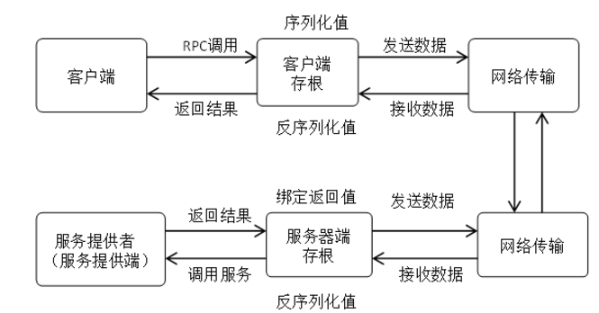

# RPC 远程过程调用 （C++编写）
## 定义
RPC是一种允许在一台计算机上的程序调用另一台计算机上子程序的技术。这种技术屏蔽了底层的网络通讯细节，使得程序间的远程通讯如同本地调用一样简单。该机制使得开发者能够构建分布式计算机系统，不同的组件分布在不同计算机上，但它们可以像在同一台机器上一样相互调用。
## 工作流程
- 客户端（Client）调用：客户端应用程序调用本地的一个存根（Stub）函数，该函数是一个本地函数，但其实现会触发远程调用。
- 存根（Stub）处理：存根函数负责将调用参数打包成一种可以在网络上传输的格式（如序列化），并通过网络发送给服务器。
- 网络传输：打包后的数据通过网络发送到服务器。
- 服务器端接收：服务器端接收并解包这些数据，调用实际的服务端程序或函数，处理请求。
- 结果返回：服务端将处理结果打包，通过网络发送回客户端。
- 客户端接收结果：客户端的存根函数接收并解包结果，然后返回给原始的调用者。

为了支持上述过程，RPC需要提供一系列功能：
- 接口定义
- 数据序列化和反序列化
- 网络通信
- 负载均衡
- 服务注册与发现

## 现代化RPC框架的特点
- 高性能
- 跨语言支持
- 可扩展性
- 安全性
